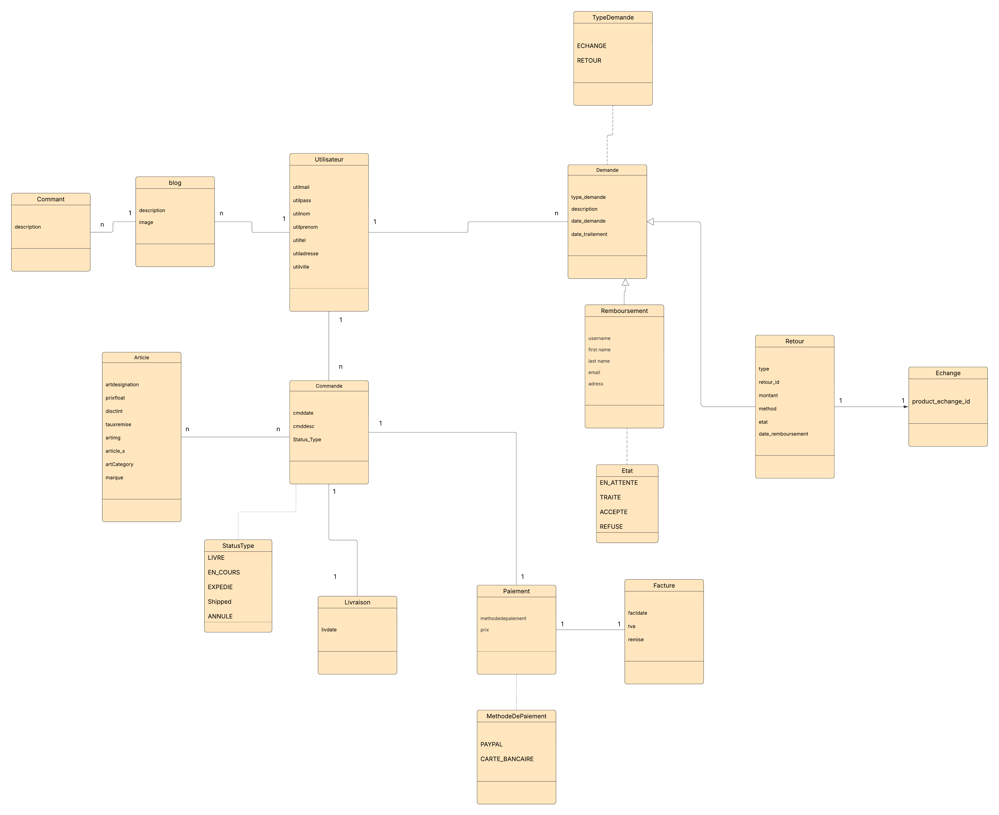
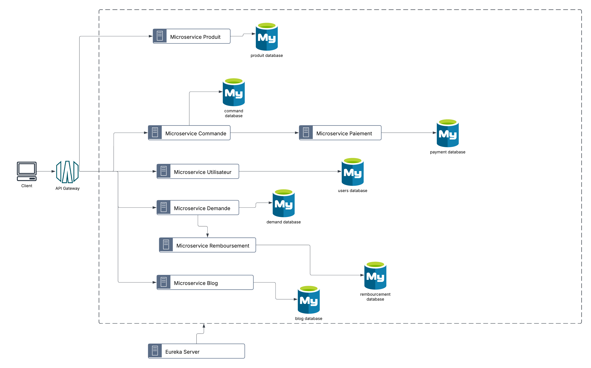

# Complete Tutorial: Rebuilding the E-commerce and Stock Management Project

This tutorial is a comprehensive guide for beginners to rebuild your "Mini-Projet E-commerce - Architecture Microservices" from scratch, based on the code and details provided in your GitHub repository (https://github.com/achrafbannour1/mico_keyclock_project). The project is a scalable e-commerce platform built with a microservices architecture, using Spring Boot for the backend, Angular for the frontend, Keycloak for authentication, MySQL for databases, and Docker for containerization. It also leverages Eureka for service discovery, Spring Cloud Gateway for routing, and Kafka or RabbitMQ for asynchronous communication.

The tutorial is structured to start simply, focusing on building each microservice independently, and gradually introducing complex integrations like Keycloak and Docker. Each section of your provided code is explained in detail, with step-by-step instructions to ensure a beginner can follow along and recreate the project. By the end, you’ll have a fully functional e-commerce system with features like product management, order processing, payment handling, delivery tracking, user management, and a blog.

## Part 1: Introduction to the Project

### 1.1 What is the Project?

Your project is an e-commerce platform that allows users to:

- Browse and manage products in a catalog.
- Place orders and process payments.
- Track deliveries and manage returns or exchanges.
- Authenticate and manage user accounts.
- Engage with blog posts and comments.

The platform is built using a microservices architecture, where each functionality is handled by an independent service. This design ensures scalability, maintainability, and flexibility, making it easier to update or add features.

### 1.2 Why Microservices?

Microservices split the application into small, independent services that communicate with each other. Benefits include:

- **Scalability**: Each service can be scaled independently based on demand.
- **Maintainability**: Smaller services are easier to develop, test, and update.
- **Resilience**: If one service fails, others can continue functioning.
- **Flexibility**: New features can be added as separate services without affecting existing ones.

### 1.3 Technologies Used

The project uses the following technologies:

- **Java Spring Boot**: For building backend microservices.
- **Angular**: For the frontend user interface.
- **Keycloak**: For user authentication and role-based access control.
- **MySQL**: For persistent data storage.
- **Docker and Docker Compose**: For containerizing and orchestrating services.
- **Eureka**: For service discovery.
- **Spring Cloud Gateway**: For routing requests to microservices.
- **Kafka or RabbitMQ**: For asynchronous communication between microservices.
- **Stripe**: For payment processing.

### 1.4 Project Architecture

The project is structured into seven microservices, plus supporting services for configuration, discovery, and routing:

- **Service Produit (ProductGestion)**: Manages products and stock.
- **Service Commande (commande-service)**: Handles order creation and management.
- **Service Paiement (payement-service)**: Processes payments and generates invoices.
- **Service Retours & Échanges (demandeGestion)**: Manages return and exchange requests.
- **Service Utilisateur (UserGestion)**: Handles user accounts and authentication via Keycloak.
- **Service Livraison (Livraison)**: Manages delivery and tracking.
- **Service Blog (Blogs)**: Manages blog posts and comments.
- **Config Server**: Centralizes configuration management.
- **Eureka Server**: Registers and discovers microservices.
- **API Gateway**: Routes requests to the appropriate microservices.

The class diagram (provided as an image) defines the relationships between entities:

- **Article → Commande**: One-to-Many (a product can be in multiple orders).
- **Commande → Livraison**: One-to-One (each order has one delivery).
- **Commande → Paiement**: One-to-One (each order has one payment).
- **Commande → Utilisateur**: Many-to-One (a user can place multiple orders).
- **Paiement → Facture**: One-to-One (each payment generates an invoice).
- **Demande → Retour/Echange**: One-to-One (a request leads to a return or exchange).
- **Retour → Remboursement**: One-to-One (a return can result in a refund).
- **Blog → Comment**: One-to-Many (a blog post can have multiple comments).





## Part 2: Setting Up the Development Environment

To start building the project, you need to set up your development environment with the necessary tools.

### 2.1 Prerequisites

Install the following tools:

- **Java Development Kit (JDK)**: Version 11 or higher (Oracle JDK). Verify with `java --version`.
- **Node.js and Angular CLI**: For frontend development (Node.js). Install Angular CLI with `npm install -g @angular/cli` and verify with `ng --version`.
- **Docker and Docker Compose**: For containerization (Docker). Verify with `docker --version` and `docker-compose --version`.
- **MySQL**: For databases (MySQL Community Server). Start the MySQL server and verify with `mysql --version`.
- **Git**: For cloning the repository (Git). Verify with `git --version`.
- **IDE**: IntelliJ IDEA or Visual Studio Code for coding.

### 2.2 Clone the Repository

Clone the project from GitHub:

```bash
git clone https://github.com/achrafbannour1/mico_keyclock_project.git
cd mico_keyclock_project
```

### 2.3 Understand the Directory Structure

The repository contains:

- **configserver**: Centralized configuration management.
- **eureka**: Service discovery server.
- **getway**: API gateway for routing.
- **MicroServices**: Folders for each microservice:
  - **Blogs**: Blog management service.
  - **commande-service**: Order management service.
  - **demandeGestion**: Return and exchange management service.
  - **Livraison**: Delivery management service.
  - **payement-service**: Payment processing service.
  - **ProductGestion**: Product management service.
  - **UserGestion**: User management service.
- **docker-compose.yml**: Orchestrates all services and databases.

## Part 3: Building the Microservices (Step-by-Step)

We’ll start by building each microservice independently. Each microservice is a Spring Boot application with its own MySQL database. Below, we explain each microservice, its purpose, key entities, controllers, and how to build it. We’ll focus on the code you provided, breaking down each section to ensure clarity for beginners.

### 3.1 Service Produit (ProductGestion)

**Purpose**: Manages the product catalog and stock, allowing users to add, view, update, and delete products.

#### Key Entity: Product

```java
package esprit.productgestion.entity;

import jakarta.persistence.Entity;
import jakarta.persistence.GeneratedValue;
import jakarta.persistence.Id;
import lombok.*;

@Entity
@Getter
@Setter
@NoArgsConstructor
@AllArgsConstructor
@ToString
public class Product {
    @Id
    @GeneratedValue
    int id;
    private String designation; // Product name
    private float prix; // Price
    private int discount; // Discount percentage
    private float tauxRemise; // Remise rate
    private String image; // Product image URL
    private String article; // Article code
    private String category; // Product category
    private String marque; // Brand
}
```

**Explanation**:

- **@Entity**: Marks this class as a JPA entity, meaning it maps to a database table.
- **@Id and @GeneratedValue**: The `id` field is the primary key, automatically generated by the database.
- **Fields**: Represent product attributes like name (`designation`), price (`prix`), discount, remise rate, image URL, article code, category, and brand.
- **Lombok Annotations**: `@Getter`, `@Setter`, `@NoArgsConstructor`, `@AllArgsConstructor`, and `@ToString` reduce boilerplate code by generating getters, setters, constructors, and a `toString` method.

#### Controller: productRestController

```java
package esprit.productgestion.restcontroller;

import esprit.productgestion.Services.IProductService;
import esprit.productgestion.entity.Product;
import org.springframework.beans.factory.annotation.Autowired;
import org.springframework.http.ResponseEntity;
import org.springframework.web.bind.annotation.*;

import java.util.List;
import java.util.Optional;

@RestController
@RequestMapping("/product")
public class productRestController {
    private final IProductService iProductService;

    @Autowired
    public productRestController(IProductService iProductService) {
        this.iProductService = iProductService;
    }

    @PostMapping
    public ResponseEntity<Product> addProduct(@RequestBody Product product) {
        System.out.println("Received POST /product with payload: " + product);
        try {
            Product createdProduct = iProductService.addProduct(product);
            System.out.println("Product created: " + createdProduct);
            return ResponseEntity.ok(createdProduct);
        } catch (Exception e) {
            System.err.println("Error creating product: " + e.getMessage());
            return ResponseEntity.badRequest().body(null);
        }
    }

    @GetMapping
    public List<Product> getAllProducts() {
        return iProductService.getAllProducts();
    }

    @GetMapping("/{id}")
    public ResponseEntity<Product> getProductById(@PathVariable int id) {
        Optional<Product> product = iProductService.getProductById(id);
        return product.map(ResponseEntity::ok).orElseGet(() -> ResponseEntity.notFound().build());
    }

    @PutMapping("/{id}")
    public ResponseEntity<Product> updateProduct(@PathVariable int id, @RequestBody Product productDetails) {
        try {
            Product updatedProduct = iProductService.updateProduct(id, productDetails);
            return ResponseEntity.ok(updatedProduct);
        } catch (RuntimeException e) {
            return ResponseEntity.notFound().build();
        }
    }

    @DeleteMapping("/{id}")
    public ResponseEntity<Void> deleteProduct(@PathVariable int id) {
        try {
            iProductService.deleteProduct(id);
            return ResponseEntity.ok().build();
        } catch (RuntimeException e) {
            return ResponseEntity.notFound().build();
        }
    }
}
```

**Explanation**:

- **@RestController**: Indicates this class handles REST API requests and returns JSON responses.
- **@RequestMapping("/product")**: All endpoints are prefixed with `/product`.
- **@Autowired**: Injects the `IProductService` bean for business logic.
- **Endpoints**:
  - **POST /product**: Creates a new product. The `@RequestBody` annotation reads the product data from the request body.
  - **GET /product**: Retrieves all products as a list.
  - **GET /product/{id}**: Retrieves a product by its ID. Returns 404 if not found.
  - **PUT /product/{id}**: Updates a product with the provided details.
  - **DELETE /product/{id}**: Deletes a product by ID.
- **Error Handling**: Uses try-catch blocks to handle exceptions, returning appropriate HTTP status codes (e.g., 400 for bad requests, 404 for not found).

#### Service Interface: IProductService

Although not provided, the `IProductService` interface likely defines methods like:

```java
public interface IProductService {
    Product addProduct(Product product);
    List<Product> getAllProducts();
    Optional<Product> getProductById(int id);
    Product updateProduct(int id, Product productDetails);
    void deleteProduct(int id);
}
```

**Explanation**: This interface declares the business logic for product management, implemented by a service class that interacts with a repository to perform database operations.

#### How to Build

1. Navigate to `MicroServices/ProductGestion` in your terminal.
2. Ensure Maven is installed (`mvn --version` to check).
3. Run the following command to build the service:

   ```bash
   mvn clean install
   ```

   This compiles the code, runs tests (if any), and packages the application into a JAR file.

4. To run locally (without Docker for now), use:

   ```bash
   mvn spring-boot:run
   ```

### 3.2 Service Commande (commande-service)

**Purpose**: Manages user orders, including creation, retrieval, and status updates.

#### Key Entity: Order

```java
package tn.esprit.commande_service.entity;

import com.fasterxml.jackson.annotation.JsonIgnore;
import com.fasterxml.jackson.annotation.JsonManagedReference;
import jakarta.persistence.*;
import lombok.*;

import java.time.LocalDate;
import java.util.ArrayList;
import java.util.List;

@Getter
@Setter
@AllArgsConstructor
@NoArgsConstructor
@ToString
@Entity(name = "orderTable")
@Builder
public class Order {
    @Id
    @GeneratedValue(strategy = GenerationType.IDENTITY)
    private Long id;
    private LocalDate orderDate;
    @Enumerated(EnumType.STRING)
    private Status status; // e.g. PENDING, PAID, CANCELED
    private Double totalAmount;
    private String customerId;
    @OneToMany(mappedBy = "order", cascade = CascadeType.ALL, orphanRemoval = true)
    private List<OrderLine> orderLines;
}
```

**Explanation**:

- **@Entity(name = "orderTable")**: Maps this class to a database table named `orderTable` (since `order` is a reserved word in SQL).
- **@Id and @GeneratedValue**: The `id` is the primary key, auto-incremented.
- **Fields**:
  - `orderDate`: When the order was placed.
  - `status`: Order status (e.g., PENDING, PAID), stored as a string.
  - `totalAmount`: Total cost of the order.
  - `customerId`: ID of the user who placed the order.
  - `orderLines`: List of products in the order, linked via a one-to-many relationship.
- **@OneToMany**: Indicates that one order can have multiple order lines, with cascading operations (e.g., deleting an order deletes its lines).
- **Lombok Annotations**: Simplify code with getters, setters, constructors, and a builder pattern.

#### Controller: OrderController

```java
package tn.esprit.commande_service.controller;

import lombok.AllArgsConstructor;
import org.springframework.http.ResponseEntity;
import org.springframework.web.bind.annotation.*;
import tn.esprit.commande_service.entity.Order;
import tn.esprit.commande_service.entity.Status;
import tn.esprit.commande_service.service.OrderService;

import java.util.List;

@AllArgsConstructor
@RequestMapping("/order")
@RestController
public class OrderController {
    OrderService orderService;

    @PostMapping
    public ResponseEntity<Order> createOrder(@RequestBody Order order) {
        System.out.println(order);
        return ResponseEntity.ok(orderService.createOrder(order));
    }

    @GetMapping("/{id}")
    public ResponseEntity<Order> getOrder(@PathVariable Long id) {
        return ResponseEntity.ok(orderService.getOrderById(id));
    }

    @GetMapping("/customer/{customerId}")
    public ResponseEntity<List<Order>> getOrdersByCustomer(@PathVariable String customerId) {
        return ResponseEntity.ok(orderService.getOrdersByCustomer(customerId));
    }

    @PatchMapping("/status/{id}")
    public ResponseEntity<Order> updateOrderStatus(
            @PathVariable Long id,
            @RequestParam Status status
    ) {
        orderService.updateOrderStatus(id, status);
        return ResponseEntity.ok().build();
    }

    @GetMapping("/getAll")
    public List<Order> getAll() {
        return orderService.getAll();
    }
}
```

**Explanation**:

- **@RestController and @RequestMapping("/order")**: Handles REST requests under `/order`.
- **@AllArgsConstructor**: Injects the `OrderService` via constructor injection.
- **Endpoints**:
  - **POST /order**: Creates a new order.
  - **GET /order/{id}**: Retrieves an order by ID.
  - **GET /order/customer/{customerId}**: Retrieves all orders for a customer.
  - **PATCH /order/status/{id}**: Updates an order’s status.
  - **GET /order/getAll**: Retrieves all orders.
- **ResponseEntity**: Wraps responses with HTTP status codes for better control.

#### How to Build

1. Navigate to `MicroServices/commande-service`.
2. Run:

   ```bash
   mvn clean install
   ```

3. Run locally:

   ```bash
   mvn spring-boot:run
   ```

### 3.3 Service Paiement (payement-service)

**Purpose**: Processes payments using Stripe and manages payment records.

#### Key Entity: Payment

```java
package tn.esprit.payement_service.entity;

import jakarta.persistence.*;
import lombok.*;

import java.time.LocalDate;

@Getter
@Setter
@AllArgsConstructor
@NoArgsConstructor
@ToString
@Entity
@Builder
public class Payment {
    @Id
    @GeneratedValue(strategy = GenerationType.IDENTITY)
    private Long id;
    private Long orderId;
    private double amount;
    private LocalDate paymentDate;
    private String paymentReference;
    @Enumerated(EnumType.STRING)
    private PaymentStatus status;
}
```

**Explanation**:

- **@Entity**: Maps to a database table for payments.
- **Fields**:
  - `orderId`: Links the payment to an order.
  - `amount`: Payment amount.
  - `paymentDate`: Date of the payment.
  - `paymentReference`: Unique reference (e.g., from Stripe).
  - `status`: Payment status (e.g., SUCCESS, FAILED).
- **Lombok**: Simplifies code with getters, setters, and a builder.

#### Controller: PaymentController

```java
package tn.esprit.payement_service.controller;

import com.stripe.Stripe;
import com.stripe.model.checkout.Session;
import com.stripe.param.checkout.SessionCreateParams;
import lombok.RequiredArgsConstructor;
import org.springframework.beans.factory.annotation.Value;
import org.springframework.http.HttpStatus;
import org.springframework.http.ResponseEntity;
import org.springframework.web.bind.annotation.*;
import tn.esprit.payement_service.entity.Payment;
import tn.esprit.payement_service.service.PaymentService;

import java.util.*;

@RequiredArgsConstructor
@RestController
@RequestMapping("/api/payment")
public class PaymentController {
    private final PaymentService paymentService;
    @Value("${stripe.secret.key}")
    private String stripeSecretKey;

    @PostMapping("/create-checkout-session")
    public Map<String, String> createCheckoutSession(@RequestBody PaymentRequest request) throws Exception {
        Stripe.apiKey = stripeSecretKey;
        SessionCreateParams params = SessionCreateParams.builder()
                .setMode(SessionCreateParams.Mode.PAYMENT)
                .setSuccessUrl("http://localhost:4200/success")
                .setCancelUrl("http://localhost:4200/cancel")
                .addLineItem(
                        SessionCreateParams.LineItem.builder()
                                .setQuantity((long) request.getQuantity())
                                .setPriceData(
                                        SessionCreateParams.LineItem.PriceData.builder()
                                                .setCurrency("eur")
                                                .setUnitAmount((long) (request.getAmount() * 100))
                                                .setProductData(
                                                        SessionCreateParams.LineItem.PriceData.ProductData.builder()
                                                                .setName("Commande #" + request.getOrderId())
                                                                .build()
                                                )
                                                .build()
                                )
                                .build()
                )
                .build();
        Session session = Session.create(params);
        Map<String, String> responseData = new HashMap<>();
        responseData.put("sessionId", session.getId());
        return responseData;
    }

    @PostMapping("/create")
    public ResponseEntity<Payment> createPayment(@RequestBody Payment payment) {
        Payment createdPayment = paymentService.createPayment(payment);
        return ResponseEntity.status(HttpStatus.CREATED).body(createdPayment);
    }

    @PutMapping("/update/{paymentId}")
    public ResponseEntity<Payment> updatePaymentStatus(@PathVariable Long paymentId, @RequestBody String paymentReference) {
        Payment updatedPayment = paymentService.updatePaymentStatus(paymentId, paymentReference);
        return ResponseEntity.ok(updatedPayment);
    }

    @GetMapping
    public List<Payment> getAllPayment() {
        return paymentService.getAllPayment();
    }
}
```

**Explanation**:

- **@RestController and @RequestMapping("/api/payment")**: Handles payment-related requests.
- **@Value("${stripe.secret.key}")**: Reads the Stripe API key from configuration.
- **Endpoints**:
  - **POST /api/payment/create-checkout-session**: Creates a Stripe checkout session for payment processing.
  - **POST /api/payment/create**: Records a payment in the database.
  - **PUT /api/payment/update/{paymentId}**: Updates a payment’s status.
  - **GET /api/payment**: Retrieves all payments.
- **Stripe Integration**: Uses the Stripe API to create checkout sessions, redirecting users to a payment page.

#### How to Build

1. Navigate to `MicroServices/payement-service`.
2. Add the Stripe dependency to `pom.xml`:

   ```xml
   <dependency>
       <groupId>com.stripe</groupId>
       <artifactId>stripe-java</artifactId>
       <version>20.128.0</version>
   </dependency>
   ```

3. Run:

   ```bash
   mvn clean install
   ```

4. Run locally:

   ```bash
   mvn spring-boot:run
   ```

### 3.4 Service Livraison (Livraison)

**Purpose**: Manages deliveries and tracking.

#### Key Entity: Livraison

The entity wasn’t fully provided, but based on the controller, it likely includes fields like:

- `id`: Primary key.
- `orderId`: Links to an order.
- `status`: Delivery status (e.g., SHIPPED, DELIVERED).
- `commentaire`: Comments or notes about the delivery.

#### Controller: LivraisonController

```java
package esprit.livraison.Controller;

import esprit.livraison.Services.livraisonserv;
import esprit.livraison.entity.Livraison;
import lombok.AllArgsConstructor;
import org.springframework.http.ResponseEntity;
import org.springframework.web.bind.annotation.*;

import java.util.List;

@AllArgsConstructor
@RestController
@RequestMapping("/Livraison")
public class LivraisonController {
    private livraisonserv service;

    @PostMapping
    public Livraison create(@RequestBody Livraison l) {
        return service.createLivraison(l);
    }

    @GetMapping
    public List<Livraison> getAll() {
        return service.getAllLivraisons();
    }

    @GetMapping("/{id}")
    public ResponseEntity<Livraison> getById(@PathVariable Long id) {
        return service.getLivraisonyById(id)
                .map(ResponseEntity::ok)
                .orElse(ResponseEntity.notFound().build());
    }

    @PutMapping("/{id}")
    public Livraison update(@PathVariable Long id, @RequestBody Livraison liv) {
        return service.updateLivraison(id, liv);
    }

    @DeleteMapping("/{id}")
    public ResponseEntity<Void> delete(@PathVariable Long id) {
        service.deleteLivraison(id);
        return ResponseEntity.noContent().build();
    }

    @PatchMapping("/{id}/commentaire")
    public ResponseEntity<Livraison> addCommentaire(@PathVariable Long id, @RequestBody String commentaire) {
        Livraison updatedLivraison = service.addCommentaire(id, commentaire);
        return ResponseEntity.ok(updatedLivraison);
    }
}
```

**Explanation**:

- **Endpoints**:
  - **POST /Livraison**: Creates a new delivery record.
  - **GET /Livraison**: Retrieves all deliveries.
  - **GET /Livraison/{id}**: Retrieves a delivery by ID.
  - **PUT /Livraison/{id}**: Updates a delivery.
  - **DELETE /Livraison/{id}**: Deletes a delivery.
  - **PATCH /Livraison/{id}/commentaire**: Adds a comment to a delivery.

#### How to Build

1. Navigate to `MicroServices/Livraison`.
2. Run:

   ```bash
   mvn clean install
   ```

3. Run locally:

   ```bash
   mvn spring-boot:run
   ```

### 3.5 Service Blog (Blogs)

**Purpose**: Manages blog posts and comments for customer engagement.

#### Key Entity: Post

```java
package com.example.blogs.Entities;

import jakarta.persistence.Entity;
import jakarta.persistence.GeneratedValue;
import jakarta.persistence.GenerationType;
import jakarta.persistence.Id;
import lombok.AllArgsConstructor;
import lombok.Getter;
import lombok.Setter;

import java.util.Date;

@Entity
@AllArgsConstructor
public class Post {
    @Id
    @GeneratedValue(strategy = GenerationType.IDENTITY)
    private Long id;
    private String name; // Post title
    private String content; // Post content
    private String postedBy; // Author
    private String img; // Image URL
    private Date date; // Publication date
    private int likeCount; // Number of likes
    private int viewCount; // Number of views;

    public Post() {
        this.date = new Date();
        this.likeCount = 0;
        this.viewCount = 0;
    }
}
```

**Explanation**:

- **Fields**: Represent a blog post with a title, content, author, image, date, likes, and views.
- **Default Constructor**: Initializes `date` to the current date and sets `likeCount` and `viewCount` to 0.

#### Controller: AdminController

```java
package com.example.blogs.Controllers;

import com.example.blogs.Entities.Post;
import com.example.blogs.Services.PostService;
import jakarta.persistence.EntityNotFoundException;
import org.springframework.beans.factory.annotation.Autowired;
import org.springframework.http.ResponseEntity;
import org.springframework.web.bind.annotation.*;

import java.util.List;

@RestController
@RequestMapping("/api/blog/admin")
public class AdminController {
    @Autowired
    private PostService postService;

    public AdminController(PostService postService) {
        this.postService = postService;
    }

    @GetMapping("/posts")
    public ResponseEntity<List<Post>> getAllPosts() {
        return ResponseEntity.ok(postService.getAllPosts());
    }

    @GetMapping("/posts/{postId}")
    public ResponseEntity<Post> getPostWithComments(@PathVariable Long postId) {
        return ResponseEntity.ok(postService.getPostById(postId));
    }

    @DeleteMapping("/posts/{postId}")
    public ResponseEntity<Void> deletePost(@PathVariable Long postId) {
        try {
            postService.deletePost(postId);
            return ResponseEntity.noContent().build();
        } catch (EntityNotFoundException e) {
            return ResponseEntity.status(404).body(null);
        } catch (Exception e) {
            return ResponseEntity.status(500).build();
        }
    }
}
```

**Explanation**:

- **Endpoints**:
  - **GET /api/blog/admin/posts**: Retrieves all blog posts.
  - **GET /api/blog/admin/posts/{postId}**: Retrieves a post by ID.
  - **DELETE /api/blog/admin/posts/{postId}**: Deletes a post.

#### How to Build

1. Navigate to `MicroServices/Blogs`.
2. Run:

   ```bash
   mvn clean install
   ```

3. Run locally:

   ```bash
   mvn spring-boot:run
   ```

### 3.6 Service Utilisateur (UserGestion)

**Purpose**: Manages user accounts and authentication, integrated with Keycloak (covered later).

#### Key Entity: User (Assumed)

Since the entity wasn’t fully provided, it likely includes fields like:

- `id`: Primary key.
- `username`: Unique username for login.
- `email`: User email address.
- `roles`: List of roles (e.g., ADMIN, USER) managed by Keycloak.

#### Security Configuration: SecurityConfig

```java
package esprit.usergestion.security;

import lombok.RequiredArgsConstructor;
import org.springframework.context.annotation.Bean;
import org.springframework.context.annotation.Configuration;
import org.springframework.security.config.annotation.method.configuration.EnableMethodSecurity;
import org.springframework.security.config.annotation.web.builders.HttpSecurity;
import org.springframework.security.config.annotation.web.configuration.EnableWebSecurity;
import org.springframework.security.web.SecurityFilterChain;
import org.springframework.security.config.annotation.web.configurers.AbstractHttpConfigurer;

import static org.springframework.security.config.Customizer.withDefaults;

@Configuration
@EnableWebSecurity
@RequiredArgsConstructor
@EnableMethodSecurity(securedEnabled = true)
public class SecurityConfig {
    @Bean
    public SecurityFilterChain securityFilterChain(HttpSecurity http) throws Exception {
        http
                .cors(withDefaults())
                .csrf(AbstractHttpConfigurer::disable)
                .authorizeHttpRequests(req -> req
                        // Public endpoints
                        .requestMatchers(
                                "/auth/**",
                                "/v2/api-docs",
                                "/v3/api-docs",
                                "/v3/api-docs/**",
                                "/swagger-resources",
                                "/swagger-resources/**",
                                "/configuration/ui",
                                "/configuration/security",
                                "/swagger-ui/**",
                                "/webjars/**",
                                "/swagger-ui.html"
                        ).permitAll()

                        // Admin-specific endpoints
                        .requestMatchers("/resource/addresource", "/resource/updateresource").hasRole("ADMIN")
                        // Allow ADMIN and MANAGER to access /keycloak/user/**
                        .requestMatchers("/keycloak/user/**").hasAnyRole("ADMIN", "MANAGER")
                        // Shared resource endpoints for ADMIN and MANAGER
                        .requestMatchers("/resource/**").hasAnyRole("ADMIN", "MANAGER")
                        // Manager-specific endpoints
                        .requestMatchers("/manager/**").hasRole("MANAGER")
                        // All other requests require authentication
                        .anyRequest().authenticated()
                )
                .oauth2ResourceServer(auth ->
                        auth.jwt(token ->
                                token.jwtAuthenticationConverter(new KeycloakJwtAuthenticationConverter())
                        )
                );

        return http.build();
    }
}
```

**Explanation**:

- **@Configuration and @EnableWebSecurity**: Configures Spring Security for the application.
- **@EnableMethodSecurity(securedEnabled = true)**: Enables method-level security with role-based access.
- **SecurityFilterChain**: Defines security rules for HTTP requests.
- **Configuration Details**:
  - `cors(withDefaults())`: Enables CORS with default settings.
  - `csrf(AbstractHttpConfigurer::disable)`: Disables CSRF protection (common for APIs using tokens).
  - `authorizeHttpRequests`: Specifies access rules:
    - Public endpoints (e.g., `/auth/**`, Swagger UI) are accessible to all.
    - `/resource/addresource` and `/resource/updateresource` require the `ADMIN` role.
    - `/keycloak/user/**` requires `ADMIN` or `MANAGER` roles.
    - `/resource/**` is accessible to `ADMIN` or `MANAGER`.
    - `/manager/**` requires the `MANAGER` role.
    - All other requests require authentication.
  - `oauth2ResourceServer`: Configures OAuth2 with JWT authentication, using a custom `KeycloakJwtAuthenticationConverter`.

#### Custom JWT Converter: KeycloakJwtAuthenticationConverter

```java
package esprit.usergestion.security;

import lombok.RequiredArgsConstructor;
import org.springframework.core.convert.converter.Converter;
import org.springframework.security.authentication.AbstractAuthenticationToken;
import org.springframework.security.core.GrantedAuthority;
import org.springframework.security.core.authority.SimpleGrantedAuthority;
import org.springframework.security.oauth2.jwt.Jwt;
import org.springframework.security.oauth2.server.resource.authentication.JwtAuthenticationToken;

import java.util.Collection;
import java.util.Collections;
import java.util.List;
import java.util.Map;
import java.util.stream.Collectors;

@RequiredArgsConstructor
public class KeycloakJwtAuthenticationConverter implements Converter<Jwt, AbstractAuthenticationToken> {

    @Override
    public AbstractAuthenticationToken convert(Jwt jwt) {
        Collection<GrantedAuthority> keycloakAuthorities = (Collection<GrantedAuthority>) extractKeycloakRoles(jwt);

        return new JwtAuthenticationToken(
                jwt,
                keycloakAuthorities
        );
    }

    private Collection<? extends GrantedAuthority> extractKeycloakRoles(Jwt jwt) {
        Map<String, Object> realmAccess = jwt.getClaimAsMap("realm_access");
        if (realmAccess == null || !realmAccess.containsKey("roles")) {
            return Collections.emptyList();
        }

        @SuppressWarnings("unchecked")
        List<String> roles = (List<String>) realmAccess.get("roles");
        if (roles == null) {
            return Collections.emptyList();
        }

        return roles.stream()
                .map(role -> new SimpleGrantedAuthority("ROLE_" + role.toUpperCase())) // Ensure uppercase and ROLE_ prefix
                .collect(Collectors.toSet());
    }
}
```

**Explanation**:

- **Converter<Jwt, AbstractAuthenticationToken>**: Converts a JWT token into an authentication token.
- **convert(Jwt jwt)**: Extracts roles from the JWT and creates a `JwtAuthenticationToken`.
- **extractKeycloakRoles(Jwt jwt)**:
  - Retrieves the `realm_access` claim from the JWT, which contains role information.
  - If `realm_access` or `roles` is missing, returns an empty list.
  - Maps each role to a `SimpleGrantedAuthority` with a `ROLE_` prefix (e.g., "ROLE_ADMIN").
- **Purpose**: Ensures Keycloak roles are properly interpreted by Spring Security.

#### Frontend Integration

```javascript
providers: [
    HttpClient,
    {
        provide: HTTP_INTERCEPTORS,
        useClass: HttpTokenInterceptor,
        multi: true
    },
    {
        provide: APP_INITIALIZER,
        deps: [KeycloakService],
        useFactory: kcFactory,
        multi: true
    }
]
```

**Explanation**:

- **HttpClient**: Angular’s HTTP client for making API requests.
- **HTTP_INTERCEPTORS**:
  - `HttpTokenInterceptor`: Intercepts HTTP requests to add the Keycloak token to the Authorization header, ensuring authenticated API calls.
  - `multi: true`: Allows multiple interceptors.
- **APP_INITIALIZER**:
  - Initializes the Keycloak service (`KeycloakService`) before the app loads.
  - `useFactory: kcFactory`: Calls a factory function (`kcFactory`) to set up Keycloak.
  - `multi: true`: Allows multiple initializers.
- **Purpose**: Integrates Keycloak authentication into the Angular frontend, ensuring users are authenticated before accessing protected routes.

#### How to Build

1. Navigate to `MicroServices/UserGestion`.
2. Add Keycloak dependencies to `pom.xml`:

   ```xml
   <dependency>
       <groupId>org.keycloak</groupId>
       <artifactId>keycloak-spring-boot-starter</artifactId>
       <version>24.0.2</version>
   </dependency>
   ```

3. Run:

   ```bash
   mvn clean install
   ```

4. Run locally:

   ```bash
   mvn spring-boot:run
   ```

5. For the frontend, navigate to the Angular project directory (assumed in the repo), install dependencies, and run:

   ```bash
   npm install
   ng serve
   ```

## Part 4: Configuring Keycloak

### 4.1 What is Keycloak?

Keycloak is an open-source identity and access management tool that provides:

- User authentication (login, registration).
- Role-based access control (e.g., ADMIN, USER).
- Single Sign-On (SSO) across microservices.

In this project, the UserGestion service uses Keycloak to manage user accounts and roles.

### 4.2 Setting Up Keycloak

Since you’ve installed Keycloak using Docker and are accessing it on port 9090, follow these steps:

#### Verify Keycloak Container

- Ensure the Keycloak container is running. Check with:

  ```bash
  docker ps
  ```

- If not running, start it using your existing Docker configuration. Update or verify your `docker-compose.yml` to include:

  ```yaml
  keycloak:
    image: quay.io/keycloak/keycloak:latest
    container_name: keycloak
    environment:
      - KEYCLOAK_ADMIN=admin
      - KEYCLOAK_ADMIN_PASSWORD=admin
      - KC_HTTP_PORT=9090
    ports:
      - "9090:9090"
    command: start-dev
    networks:
      - microservices-network
  ```

- If you used a different configuration, ensure the port mapping matches `9090:9090`.

#### Access Keycloak Admin Console

- Open your browser and go to `http://localhost:9090`.
- Log in with the admin credentials you set (e.g., username: `admin`, password: `admin`).

#### Create a Realm

- In the Keycloak admin console, create a new realm named `ecommerce`.

#### Create Clients

- For the UserGestion service, create a client:
  - **Client ID**: `user-service`.
  - **Root URL**: `http://localhost:8089`.
  - **Redirect URIs**: `http://localhost:4200/*` (for Angular frontend).
- Enable "Client Authentication" and "Authorization".
- Note the client secret for later configuration.

#### Define Roles

- Create roles: `ADMIN`, `USER`, `MANAGER`.
- Assign roles to users as needed (e.g., create a test user with the `ADMIN` role).

#### Update Docker Compose

- Ensure Keycloak is part of your `docker-compose.yml` network to communicate with other services. The network configuration should already be set up as `microservices-network`.

### 4.3 Integrating Keycloak with UserGestion

- **Configure Keycloak in `application.yml`** (`UserGestion/src/main/resources/application.yml`):

  ```yaml
  keycloak:
    realm: ecommerce
    auth-server-url: http://localhost:9090
    resource: user-service
    public-client: true
    principal-attribute: preferred_username
  ```

- **Secure Endpoints**: Update `UserGestion/src/main/java/esprit/usergestion/Controllers/KeycloakUserController.java` (assumed) to use Keycloak roles:

  ```java
  @RestController
  @RequestMapping("/keycloak/user")
  public class KeycloakUserController {
      @Autowired
      private KeycloakAdminService keycloakAdminService;

      @PostMapping("/create")
      @PreAuthorize("hasRole('ADMIN')")
      public UserRepresentation createUser(@RequestBody UserRequest userRequest) {
          // User creation logic with Keycloak
          return keycloakAdminService.createUser(userRequest);
      }
  }
  ```

- **Frontend Configuration**: Ensure the Angular app uses the correct Keycloak URL in `kcFactory`:

  ```javascript
  function kcFactory(keycloakService: KeycloakService) {
      return () => keycloakService.init({
          config: {
              url: 'http://localhost:9090',
              realm: 'ecommerce',
              clientId: 'user-service'
          },
          initOptions: {
              onLoad: 'login-required',
              checkLoginIframe: false
          }
      });
  }
  ```

## Part 5: Setting Up Databases

Each microservice uses a separate MySQL database, defined in `docker-compose.yml`:

| Service         | Database Name  | Port  |
|-----------------|----------------|-------|
| ProductGestion  | ProductGestion | 3308  |
| commande-service| commandeGestion| 3309  |
| payement-service| PaimentGestion | 3311  |
| demandeGestion  | demandeGestion | 3312  |
| UserGestion     | springdb       | 3307  |
| Livraison       | LivraisonGestion | 3310 |

- **Configuration Example** (`ProductGestion/src/main/resources/application.yml`):

  ```yaml
  spring:
    datasource:
      url: jdbc:mysql://productgestion-db:3306/ProductGestion?createDatabaseIfNotExist=true
      username: root
      password: ""
  ```

## Part 6: Containerization with Docker

- **Docker Compose** (`docker-compose.yml`):

  ```yaml
  version: '3.8'
  services:
    configserver:
      build: ./configserver
      ports:
        - "8888:8888"
    eureka:
      build: ./eureka
      ports:
        - "8761:8761"
    gateway:
      build: ./getway
      ports:
        - "8030:8030"
    productgestion:
      build: ./MicroServices/ProductGestion
      ports:
        - "8081:8081"
    commandeservice:
      build: ./MicroServices/commande-service
      ports:
        - "8082:8082"
    payementservice:
      build: ./MicroServices/payement-service
      ports:
        - "8083:8083"
    livraison:
      build: ./MicroServices/Livraison
      ports:
        - "8084:8084"
    blogs:
      build: ./MicroServices/Blogs
      ports:
        - "8085:8085"
    usergestion:
      build: ./MicroServices/UserGestion
      ports:
        - "8089:8089"
    keycloak:
      image: quay.io/keycloak/keycloak:latest
      container_name: keycloak
      environment:
        - KEYCLOAK_ADMIN=admin
        - KEYCLOAK_ADMIN_PASSWORD=admin
        - KC_HTTP_PORT=9090
      ports:
        - "9090:9090"
      command: start-dev
      networks:
        - microservices-network
    productgestion-db:
      image: mysql:5.7
      environment:
        - MYSQL_ROOT_PASSWORD=
        - MYSQL_DATABASE=ProductGestion
      ports:
        - "3308:3306"
    commandeservice-db:
      image: mysql:5.7
      environment:
        - MYSQL_ROOT_PASSWORD=
        - MYSQL_DATABASE=commandeGestion
      ports:
        - "3309:3306"
    payementservice-db:
      image: mysql:5.7
      environment:
        - MYSQL_ROOT_PASSWORD=
        - MYSQL_DATABASE=PaimentGestion
      ports:
        - "3311:3306"
    demandegestion-db:
      image: mysql:5.7
      environment:
        - MYSQL_ROOT_PASSWORD=
        - MYSQL_DATABASE=demandeGestion
      ports:
        - "3312:3306"
    usergestion-db:
      image: mysql:5.7
      environment:
        - MYSQL_ROOT_PASSWORD=
        - MYSQL_DATABASE=springdb
      ports:
        - "3307:3306"
    livraison-db:
      image: mysql:5.7
      environment:
        - MYSQL_ROOT_PASSWORD=
        - MYSQL_DATABASE=LivraisonGestion
      ports:
        - "3310:3306"
  networks:
    microservices-network:
      driver: bridge
  ```

- Run the application:

  ```bash
  docker-compose up
  ```

## Part 7: Frontend Development with Angular

### Setup

- Navigate to the Angular project directory (assumed to be in the repository).
- Install dependencies:

  ```bash
  npm install
  ```

- Run the frontend:

  ```bash
  ng serve
  ```

#### Key Components

- Product listing, cart, checkout, user profile, blog.

#### API Integration

- Connect to the API Gateway (`http://localhost:8030`).


## Part 8: Troubleshooting and Best Practices

### Common Issues

- **Database Connection Errors**: Ensure MySQL containers are running and credentials match.
- **Keycloak Issues**: Verify realm and client configurations, and ensure port 9090 is accessible.
- **Service Discovery**: Ensure Eureka is running before other services.

### Best Practices

- Use environment variables for sensitive data (e.g., Stripe API key).
- Monitor services with tools like Prometheus and Grafana.
- Scale services using Docker Compose or Kubernetes.

## Conclusion

This tutorial provides a complete guide to rebuilding the e-commerce project. By setting up the environment, configuring Keycloak on port 9090 with Docker, building microservices, and deploying with Docker, you can create a scalable and robust e-commerce platform. Refer to the GitHub repository for additional details and code.

## Resources

- [GitHub Repository](https://github.com/achrafbannour1/mico_keyclock_project)
- [Keycloak Documentation](https://www.keycloak.org/documentation)
- [Spring Boot Documentation](https://spring.io/projects/spring-boot)
- [Docker Documentation](https://docs.docker.com/)
- [Angular Documentation](https://angular.io/docs)

